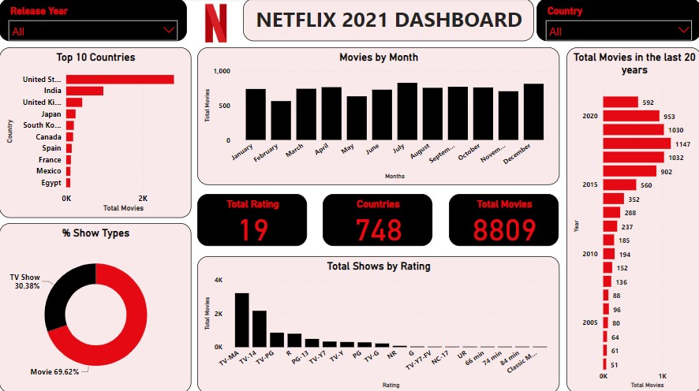
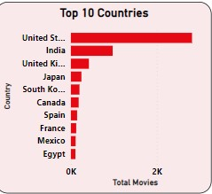
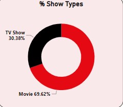
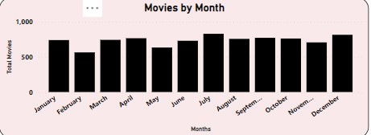
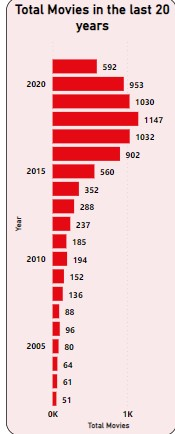

# NETFLIX
AN ANALYSIS ON THE PROGRESSION OF NETFLIX SINCE INCEPTION

---

## INTRODUCTION
Netflix is a streaming service that offers a wide variety of award-winning TV shows, movies, anime, documentaries and more on thousands of internet-connected device. It is one of the world leading entertainment services with over 232 million paid membership in over 190 countries enjoying TV series and movies of different genres and languages.

## AIM OF ANALYSIS
The analysis is aimed at checking the progression of Netflix since inception till 2021. Also to check their activities during the year, the rate of realease of movies, the total number of movies released and the type of movies and TV shows being released.

## SKILLS DEMONSTRATED
The data was loaded into power query for cleaning and transformation, it was then glanced through to check for errors and blanks before further proceeding into the data cleaning. Some of the skills demonstrated during the cleaning include;
1.	Page navigation
2.	column reordering
3.	Sort and filter
4.	Replace values 
5.	Replace errors 
6.	Split column

## ANALYSIS AND VISUALIZATION
The visualization was done using Microsoft Power BI. 

You can interract with the report [here](https://app.powerbi.com/view?r=eyJrIjoiZDQ1YTdlMjctOWMzYS00YWNhLTg3YjItNGJhYjk2YzJmZTAzIiwidCI6ImRmODY3OWNkLWE4MGUtNDVkOC05OWFjLWM4M2VkN2ZmOTVhMCJ9&embedImagePlaceholder=true)

- **TOP 10 COUNTRIES:** This chart shows the top 10 county movies on Netflix. The countries include
  - United States
  - India
  - United Kingdom
  - Japan 
  - South Korea
  - Canada
  - Spain
  - France
  - Mexico
  - Egypt
  

- **% SHOW TYPES:** This states the percentage of show types on Netflix which shows that there are more movies than TV shows on Netflix with 69.62% and 30.38% respectively.

- **NO OF MOVIES PER MONTH:** This chart indicates the number of movie that have been released in each month.

- **MOVIES PER RATING:** This shows the rating of movies and number of movies per each rating. 

- **NUMBER OF MOVIES IN THE LAST 20 YEARS:** This chart displays the total number of movies released on Netflix in the last 20 years in which 2018 is the year with the highest number of movies released.

---
## CONCLUSION AND RECOMMENDATION

Netflix should increase the number of TV shows they are releasing and should make their movies and shows cut across all other types of rating as the analysis shows that most movies released are mostly rated TV-MA and TV-14.
